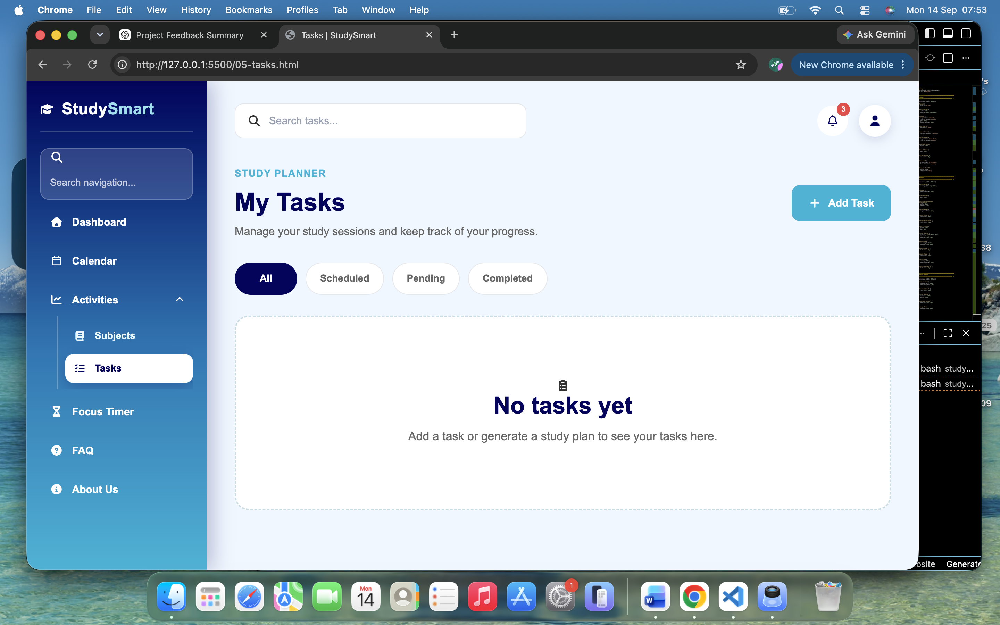
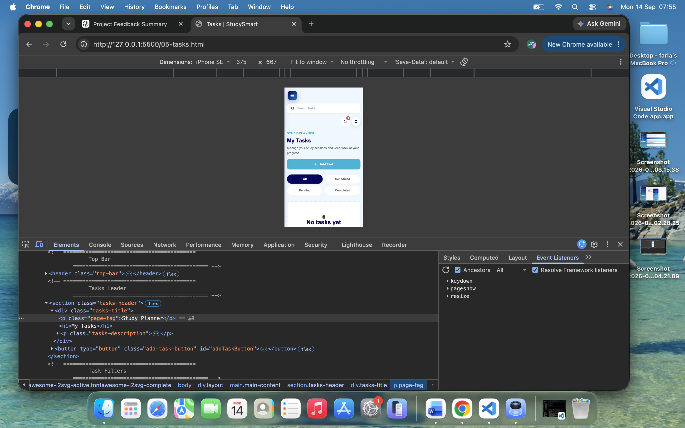
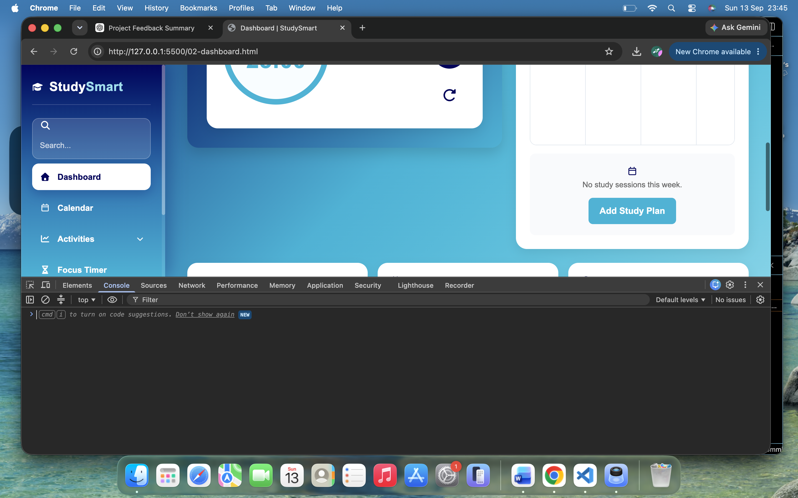
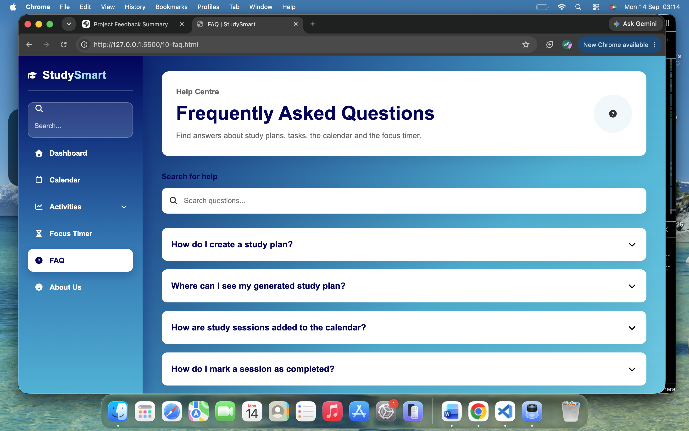
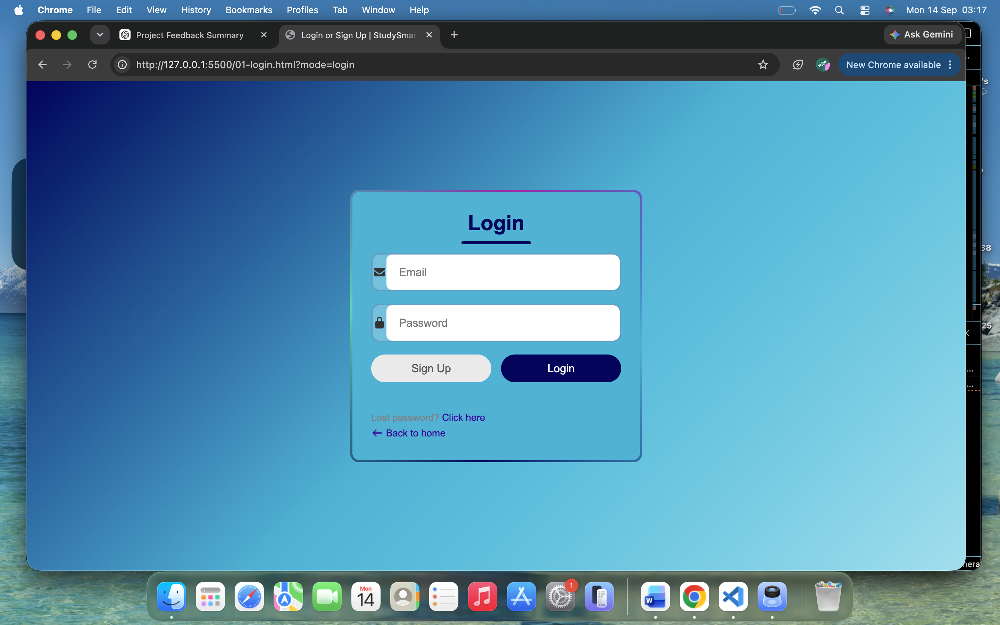

# Testing

## 3.1 Manual and Automated Testing

### Manual Testing

Manual testing is the process of testing a web application by interacting
with it directly as a user. The tester performs actions such as clicking
buttons, entering information into forms, navigating between pages and
checking whether the expected result occurs.

Manual testing is useful for checking:

- User interface behaviour
- Navigation
- Form validation
- Usability
- Accessibility
- Responsive layouts
- Visual consistency
- User feedback
- Features that require human judgement

### Automated Testing

Automated testing uses software tools or scripts to perform tests
automatically. Automated tests can repeatedly check application
functionality and can be useful for identifying regressions when code
changes are made.

Automated testing is particularly useful for:

- Repeated tests
- Regression testing
- Large numbers of test cases
- Checking consistent expected results
- Testing functionality after code changes

### Testing Approach Used for StudySmart Planner

Manual testing was used extensively during the development and testing
of StudySmart Planner because the application is a front-end web
application where many requirements involve user interaction,
navigation, visual presentation and responsive behaviour.

Manual testing allowed the application to be tested from the perspective
of a student user. Features such as registration, login, study planning,
task management, calendar functionality, FAQ interaction and the
Pomodoro timer were tested by interacting with the application.

Manual testing was also used to check the appearance and usability of
the application at different screen sizes.

Automated validation tools were also used where appropriate to identify
HTML, CSS and JavaScript issues.

---

## 3.2 Test Procedures

The following test cases were created to test the functionality,
usability, authentication and responsiveness of StudySmart Planner.

### Functional Testing

#### Login and Registration Testing

The registration and login functionality was tested in the local
development environment using the Chrome browser. Both valid and
invalid inputs were tested to confirm that the application provides
appropriate feedback to the user.

### T01 – Login Page Loads

**Test:**  
Open the StudySmart Planner login page in the local development
environment.

**Expected result:**  
The login page should load correctly and display the required login
controls without visible errors.

**Actual result:**  
The login page loaded successfully in the local development environment.

**Result:** PASS

**Evidence:**

---

### T02 – Successful Registration

**Test:**  
Enter valid registration information and submit the registration form.

**Expected result:**  
A new account should be created and the application should provide
confirmation feedback.

**Actual result:**  
The application displayed the message "Account created successfully."

**Result:** PASS

**Evidence:**

---

### T03 – Login with Empty Fields

**Test:**  
Submit the login form without entering an email address or password.

**Expected result:**  
The application should prevent the login attempt and provide clear
feedback explaining that the required information must be entered.

**Actual result:**  
The application displayed the message
"Please enter your email and password."

**Result:** PASS

**Evidence:**

---

### T04 – Invalid Login Details

**Test:**  
Enter invalid login credentials and select the Login button.

**Expected result:**  
The application should reject the invalid credentials and provide
appropriate feedback to the user.

**Actual result:**  
The application rejected the invalid login details and displayed the
appropriate feedback message.

**Result:** PASS

**Evidence:**

---

### T05 – Successful Login

**Test:**  
Enter valid registered login credentials and select the Login button.

**Expected result:**  
The user should be successfully logged in and receive confirmation
before accessing the application.

**Actual result:**  
The application displayed the message "Welcome Nadia!" confirming that
the login was successful.

**Result:** PASS

**Evidence:**

---

### T06 – Dashboard Loads

**Test:**  
Open the Dashboard after successfully logging into the StudySmart
application.

**Expected result:**  
The Dashboard should load successfully and display the main navigation,
welcome message, focus timer, weekly study calendar, study-session
information and task information.

**Actual result:**  
The Dashboard loaded successfully in the local development environment.
The main navigation, welcome message, focus timer, weekly study
calendar, study-session information and task information were displayed
correctly. No obvious visual layout problems were identified during the
initial check.

**Result:** PASS

**Evidence:**

---

## Responsive Testing

Responsive testing was carried out using Chrome DevTools device
emulation to check that StudySmart Planner remained usable across
desktop, tablet and mobile screen sizes.

The tests checked:

- Page layout
- Navigation
- Controls
- Readability
- Horizontal overflow
- Mobile usability

### Responsive Test Results

| Test ID | Page | Viewport | Test | Expected Result | Actual Result | Result |
|---|---|---|---|---|---|---|
| R04 | Tasks | Desktop | Open Tasks page | Page displays correctly with usable navigation and controls | Tasks page displayed correctly | PASS |
| R05 | Tasks | Mobile 390 × 844 | Open Tasks page | Layout adapts without horizontal scrolling | Mobile layout adapted correctly | PASS |
| R06 | About Us | Desktop | Open About Us page | Page displays correctly with consistent navigation | About Us page displayed correctly | PASS |
| R07 | About Us | Mobile 390 × 844 | Open About Us page | Content remains readable and usable | Mobile layout adapted correctly | PASS |
| R08 | Subjects | Desktop | Open Subjects page | Subject cards and navigation display correctly | Subjects page displayed correctly | PASS |
| R09 | Subjects | Mobile 390 × 844 | Open Subjects page | Subject cards adapt to mobile screen | Subject cards adapted correctly | PASS |
| R10 | Calendar | Desktop | Open Calendar page | Calendar and controls display correctly | Calendar displayed correctly | PASS |
| R11 | Calendar | Mobile 390 × 844 | Open Calendar page | Calendar remains usable on mobile | Calendar adapted correctly | PASS |
| R12 | FAQ | Desktop | Open FAQ page | Questions and navigation display correctly | FAQ displayed correctly | PASS |
| R13 | FAQ | Mobile 390 × 844 | Open FAQ page | Questions remain readable and usable | FAQ adapted correctly | PASS |
| R14 | Focus Timer | Desktop | Open Focus Timer page | Settings display correctly | Focus Timer displayed correctly | PASS |
| R15 | Focus Timer | Mobile 390 × 844 | Open Focus Timer page | Settings adapt without horizontal scrolling | Focus Timer adapted correctly | PASS |

### R04 – Tasks Desktop Testing

**Test:**  
Open the Tasks page on a desktop browser.

**Expected result:**  
The Tasks page should display the navigation, search, Add Task button,
filters and task content correctly.

**Actual result:**  
The Tasks page displayed correctly on desktop with the expected
navigation and task controls.

**Result:** PASS

**Evidence:**

---

### R05 – Tasks Mobile Testing

**Test:**  
Open the Tasks page using Chrome DevTools mobile device emulation.

**Device:**  
390 × 844 pixels.

**Expected result:**  
The Tasks page should adapt to the mobile screen and remain usable
without horizontal scrolling.

**Actual result:**  
The Tasks page adapted correctly to the mobile viewport. The search,
Add Task button, filters and task content remained usable.

**Result:** PASS

**Evidence:**

---

## Authentication Testing

Authentication testing was carried out to ensure that member-only pages
could not be accessed by users who were not logged in, while
authenticated users could access the application normally.

The authentication process uses the `loggedIn` state stored in browser
`localStorage`.

### Authentication Test Results

| Test ID | Feature | Test | Expected Result | Actual Result | Result |
|---|---|---|---|---|---|
| A01 | Authentication | Open FAQ directly while logged out | User is redirected to Login | User was redirected to Login | PASS |
| A02 | Authentication | Open FAQ while logged in | FAQ page opens successfully | FAQ page opened successfully | PASS |
| A03 | Logout | Logout and open FAQ directly | User is redirected to Login | User was redirected to Login | PASS |

### A01 – Unauthenticated FAQ Access

**Test:**  
Remove the `loggedIn` state and enter the FAQ URL directly while logged
out.

**Expected result:**  
The user should be redirected to the Login page.

**Actual result:**  
The user was redirected to the Login page instead of being allowed to
access the FAQ page.

**Result:** PASS

**Evidence:**

---

### A02 – Authenticated FAQ Access

**Test:**  
Log in successfully and open the FAQ page.

**Expected result:**  
The FAQ page should load successfully.

**Actual result:**  
The FAQ page loaded successfully after login.

**Result:** PASS

**Evidence:**

---

### A03 – Access After Logout

**Test:**  
Log out and then attempt to open the FAQ page directly.

**Expected result:**  
The user should be redirected to the Login page.

**Actual result:**  
The user was redirected to the Login page.

**Result:** PASS

**Evidence:**

---

## Bugs Found and Fixes

### Bug 1 – FAQ Navigation Inconsistency

**Problem:**  
The FAQ page used navigation that was inconsistent with the other
member pages.

**Fix:**  
The FAQ page was updated to use the shared member navigation and
consistent StudySmart styling.

**Retest:**  
The FAQ page was reopened and compared with the Dashboard and other
member pages.

**Result:** PASS

---

### Bug 2 – Broken FAQ Internal Link

**Problem:**  
The FAQ navigation contained an incorrect internal link.

**Fix:**  
The link was corrected to `10-faq.html`.

**Retest:**  
The FAQ link was selected from the navigation.

**Result:** PASS

---

### Bug 3 – Unauthenticated Access to Member Pages

**Problem:**  
A user could attempt to access a member-only page directly by entering
the page URL.

**Fix:**  
An authentication guard was added to member-only pages.

**Retest:**  
The FAQ URL was opened while logged out.

**Result:**  
The user was redirected to the Login page.

**Result:** PASS

---

### Bug 4 – Logout Authentication State

**Problem:**  
The application needed to clear the logged-in state when the user
logged out.

**Fix:**  
The logout functionality was updated to remove the `loggedIn` state from
browser `localStorage`.

**Retest:**  
The user logged out and then attempted to open the FAQ page directly.

**Result:**  
The user was redirected to the Login page.

**Result:** PASS

---

## Development Testing

Testing was carried out during development rather than only at the end
of the project.

After changes were made to HTML, CSS or JavaScript, the affected page
was reopened and tested to check that the change had not introduced new
problems.

Development testing included:

- Checking page navigation
- Testing login and logout
- Checking authentication protection
- Checking form validation
- Checking responsive layouts
- Checking shared navigation
- Checking buttons and interactive controls
- Checking visual consistency
- Checking browser console errors where appropriate

---

## Deployed Testing

The final application was also tested after deployment to ensure that
the deployed version continued to work correctly.

The deployed application was checked for:

- Page loading
- Internal navigation
- Login functionality
- Authentication protection
- Logout behaviour
- Responsive layout
- Visual consistency

Testing the deployed version helped confirm that the application
continued to work after being published.

---

## Retesting

Retesting was carried out after identified issues were fixed.

The main fixes were retested to confirm that:

- The FAQ navigation worked correctly.
- Member pages used consistent navigation.
- Logged-out users were redirected to the Login page.
- Logged-in users could access member pages.
- Logout cleared the logged-in state.
- Responsive layouts remained usable.
- Updated CSS did not introduce obvious layout problems.

The relevant tests passed after the fixes were applied.

---

## Remaining Limitations

StudySmart Planner uses browser `localStorage` for coursework
authentication and application data.

This demonstrates member-only front-end behaviour, but it is not
production-level server-side authentication.

The project is therefore suitable as a front-end coursework application,
but a production application would require a secure server-side
authentication system and database.

---

## Final Testing Summary

Testing was carried out throughout the development of StudySmart Planner
rather than only after development was completed.

Manual testing was used to check functionality, navigation, forms,
authentication, usability and responsive behaviour.

Automated validation tools were used where appropriate to identify
HTML, CSS and JavaScript issues.

Functional, responsive and authentication tests were recorded with
expected results, actual results and supporting screenshots where
available.

Bugs identified during development were fixed and the affected
functionality was retested.

The testing process helped improve the reliability, consistency,
accessibility and usability of the final StudySmart Planner application.