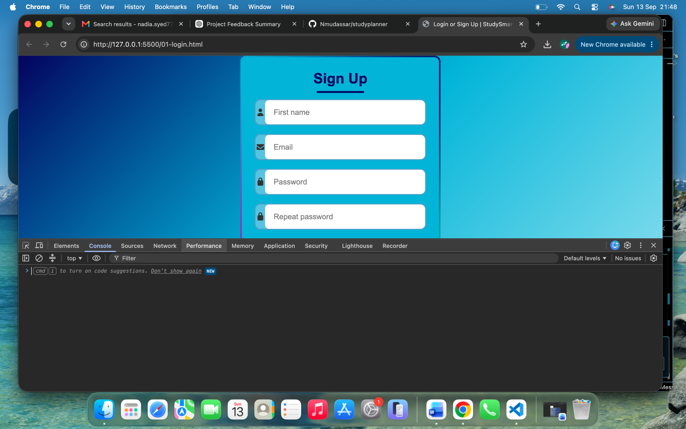
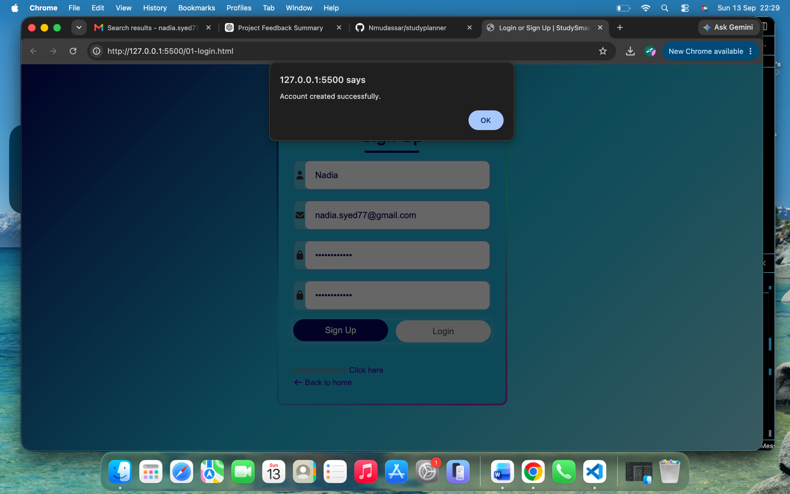
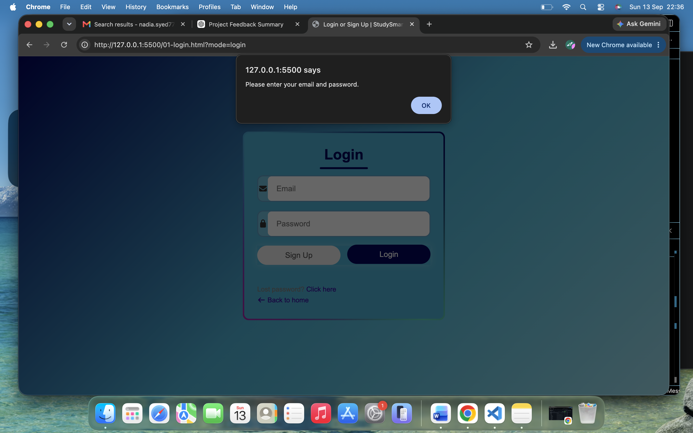
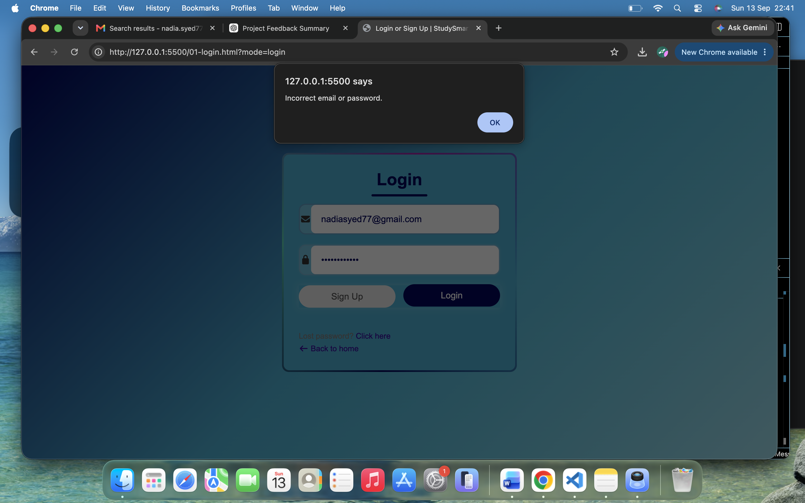
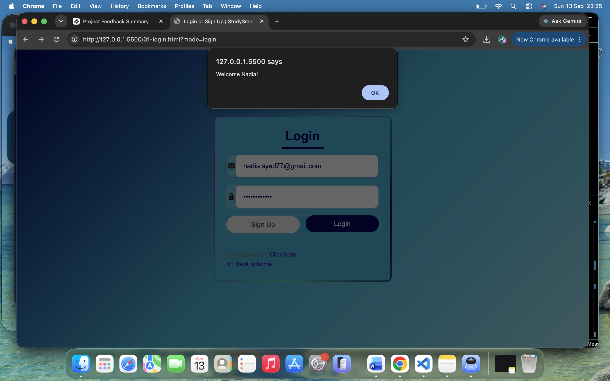

# Testing

## 3.1 Manual and Automated Testing

### Manual Testing

Manual testing is the process of testing a web application by interacting with it directly as a user. The tester performs actions such as clicking buttons, entering information into forms, navigating between pages and checking whether the expected result occurs.

Manual testing is useful for checking:

- User interface behaviour
- Navigation
- Form validation
- Usability
- Accessibility
- Responsive layouts
- Visual consistency
- User feedback
- Features that require human judgement

### Automated Testing

Automated testing uses software tools or scripts to perform tests automatically. Automated tests can repeatedly check application functionality and can be useful for identifying regressions when code changes are made.

Automated testing is particularly useful for:

- Repeated tests
- Regression testing
- Large numbers of test cases
- Checking consistent expected results
- Testing functionality after code changes

### Testing approach used for StudySmart Planner

Manual testing was used extensively during the development and testing of StudySmart Planner because the application is a front-end web application where many requirements involve user interaction, navigation, visual presentation and responsive behaviour.

Manual testing allowed the application to be tested from the perspective of a student user. Features such as registration, login, study planning, task management, calendar functionality, FAQ interaction and the Pomodoro timer were tested by interacting with the deployed application.

Manual testing was also used to check the appearance and usability of the application at different screen sizes.

Automated validation tools were also used where appropriate to identify HTML, CSS and JavaScript issues.

## 3.2 Test Procedures

The following test cases were created to test the functionality, usability and responsiveness of StudySmart Planner.

### Login and Registration Testing

The registration and login functionality was tested in the local development environment using the Chrome browser. Both valid and invalid inputs were tested to confirm that the application provides appropriate feedback to the user.

#### T01 – Login Page Loads

**Test:**  
Open the StudySmart Planner login page in the local development environment.

**Expected result:**  
The login page should load correctly and display the required login controls without visible errors.

**Actual result:**  
The login page loaded successfully in the local development environment.

**Result:** PASS

**Evidence:**

#### T02 – Successful Registration

**Test:**  
Enter valid registration information and submit the registration form.

**Expected result:**  
A new account should be created and the application should provide confirmation feedback.

**Actual result:**  
The application displayed the message "Account created successfully."

**Result:** PASS

**Evidence:**

#### T03 – Login with Empty Fields

**Test:**  
Submit the login form without entering an email address or password.

**Expected result:**  
The application should prevent the login attempt and provide clear feedback explaining that the required information must be entered.

**Actual result:**  
The application displayed the message "Please enter your email and password."

**Result:** PASS

**Evidence:**

#### T04 – Invalid Login Details

**Test:**  
Enter invalid login credentials and select the Login button.

**Expected result:**  
The application should reject the invalid credentials and provide appropriate feedback to the user.

**Actual result:**  
The application rejected the invalid login details and displayed the appropriate feedback message.

**Result:** PASS

**Evidence:**

#### T05 – Successful Login

**Test:**  
Enter valid registered login credentials and select the Login button.

**Expected result:**  
The user should be successfully logged in and receive confirmation before accessing the application.

**Actual result:**  
The application displayed the message "Welcome Nadia!" confirming that the login was successful.

**Result:** PASS

**Evidence:**

### Login and Registration Testing

| Test ID | Feature | Test | Expected Result | Actual Result | Result |
|---|---|---|---|---|---|
| T01 | Login | Open login page | Login page loads correctly | Login page loaded successfully | PASS |
| T02 | Registration | Enter valid registration details | Account should be created | "Account created successfully." displayed | PASS |
| T03 | Login | Submit empty login form | Validation feedback should be displayed | "Please enter your email and password." displayed | PASS |
| T04 | Login | Enter invalid credentials | Invalid login should be rejected with feedback | Invalid login was rejected and feedback was displayed | PASS |
| T05 | Login | Enter valid registered credentials | User should successfully log in | "Welcome Nadia!" displayed | PASS |

### T01 – Login Page Loads

**Test:**  
Open the StudySmart Planner login page in the local development environment.

**Expected result:**  
The login page should load correctly and display the required login controls without visible errors.

**Actual result:**  
The login page loaded successfully in the local development environment.

**Result:** PASS

**Evidence:**

### T02 – Successful Registration

**Test:**  
Enter valid registration information and submit the registration form.

**Expected result:**  
A new account should be created and the application should provide confirmation feedback.

**Actual result:**  
The application displayed the message "Account created successfully."

**Result:** PASS

**Evidence:**

### T03 – Login with Empty Fields

**Test:**  
Submit the login form without entering an email address or password.

**Expected result:**  
The application should prevent the login attempt and provide clear feedback explaining that the required information must be entered.

**Actual result:**  
The application displayed the message "Please enter your email and password."

**Result:** PASS

**Evidence:**

